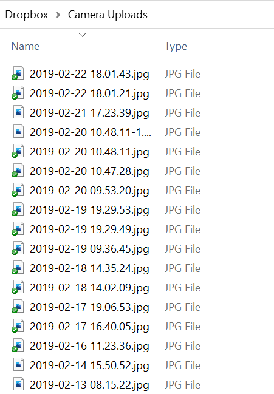
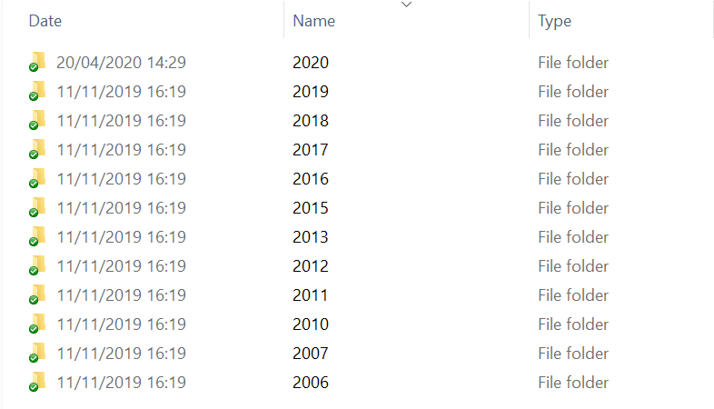
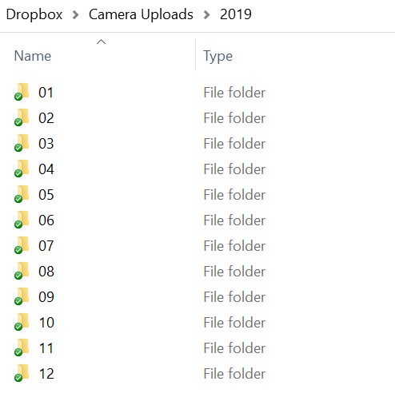

#### Blog Link.
https://johndobie.com/blog/organising-dropbox-photos-by-year-and-month-with-go
See the blog for full details on this code.

#### Organise Dropbox Photos
By default dropbox dumps all your new photo uploads into a single directory.
This makes it really hard to look at them when you have hundreds.



#### Organise your photos
This program will organise your photos by year and month instead.





#### Running the Executable

You can run it by going into the bin directory and running it with the following command
```text
dropbox -uploadDir="D:/Dropbox/Camera Uploads"
```

This will process all of the files in the passed in camera uploads folder.
If a file has a filename in the correct format ,  it will be moved into a new sub folder.

For example, 2019-11-17 14.30.17.jpg will be moved into /2019/11